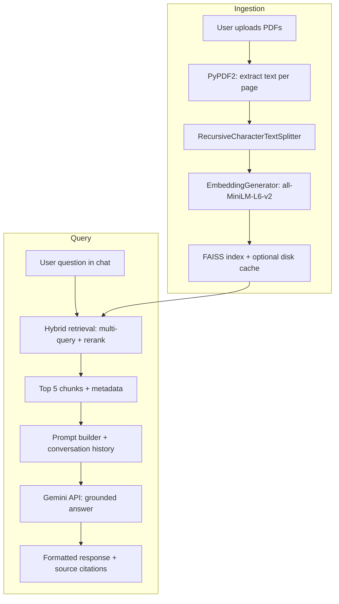

# Ask My Docs — AI-Powered Document Assistant

[](https://www.python.org/)
[](https://streamlit.io/)
[](https://python.langchain.com/)
[](https://github.com/facebookresearch/faiss)
[](https://ai.google.dev/)
[](LICENSE)

> **AI Developer Assessment Submission**  
> Retrieval-Augmented Generation (RAG) over PDF documents with a modern SaaS-style Streamlit interface.

---

## 📋 Table of Contents

1. [Candidate Information](#1-candidate-information)
2. [Project Overview](#2-project-overview)
3. [Features](#3-features)
4. [Tech Stack](#4-tech-stack)
5. [Architecture / Workflow](#5-architecture--workflow)
6. [Setup Instructions](#6-setup-instructions)
7. [Environment Variables](#7-environment-variables)
8. [Local Run Instructions](#8-local-run-instructions)
9. [Deployment URL](#9-deployment-url)
10. [Feature Completion Checklist](#10-feature-completion-checklist)
11. [Known Issues / Limitations](#11-known-issues--limitations)
12. [Bonus Features](#12-bonus-features)
13. [Sample Q&A Pairs](#13-sample-qa-pairs)
14. [Demo Recording](#14-demo-recording)
15. [Screenshots](#15-screenshots)
16. [Project Structure](#16-project-structure)
17. [Contact & Repository](#17-contact--repository)

---

## 1. Candidate Information

| Field | Details |
|-------|---------|
| **Full Name** | _Sanjana Manjunath_|
| **Email** | _sanjanamanjunath060@gmail.com_ |
| **Phone Number** | _+91 9964290296_ |
| **Role Applied For** | **AI Developer** |
| **GitHub Repository** | [github.com/Sanjanamanjunath2515/ask-my-docs-rag](https://github.com/Sanjanamanjunath2515/ask-my-docs-rag) |
| **Assessment Date** | _22 May 2026_ |

---

## 2. Project Overview

**Ask My Docs** is an AI-powered document assistant that lets users upload PDF files, index them locally, and ask natural-language questions grounded in document content only.

### What the application does

| Capability | Description |
|------------|-------------|
| **Multi-PDF upload** | Users drag-and-drop or browse PDFs in the sidebar (multiple files supported). |
| **Ingestion pipeline** | Text is extracted, chunked, embedded, and stored in a FAISS vector index. |
| **Semantic search** | User questions are embedded and matched to the most relevant document chunks. |
| **Grounded answers** | **Google Gemini** generates responses strictly from retrieved context—not from general world knowledge. |
| **Source citations** | Each answer can include expandable citations (filename, page, chunk excerpt). |
| **Modern AI SaaS UI** | Hero section, stat cards, themed chat, Lottie animation, dark/light mode, and responsive sidebar upload. |

### How it works (high level)

1. **Upload PDFs** via the Streamlit sidebar file uploader.
2. Click **Process Documents** to run extraction → chunking → **sentence-transformers** embeddings → **FAISS** indexing.
3. Ask questions in the chat interface; the app retrieves top chunks and sends them to **Gemini**.
4. View answers with optional **source citations** and conversation history within the session.

---

## 3. Features

### Core RAG capabilities

- ✅ Upload **multiple PDFs** in one session
- ✅ **PyPDF2** text extraction with per-file error handling
- ✅ **LangChain** `RecursiveCharacterTextSplitter` (900 chars / 150 overlap)
- ✅ Local **sentence-transformers** embeddings (`all-MiniLM-L6-v2`)
- ✅ **FAISS** cosine similarity search (L2-normalized inner product)
- ✅ **Hybrid retrieval** — multi-query expansion, over-fetch, rerank, top-5 chunks
- ✅ **Gemini** REST-based generation with model fallback and safe timeout handling
- ✅ Grounded answers with **“I don’t know based on these documents.”** when context is insufficient
- ✅ **Source citations** (filename, page, chunk preview)

### User experience

- ✅ Sidebar upload zone with professional chip styling
- ✅ **Process Documents** status steps (analyze → split → embed → index)
- ✅ Chat UI with `st.chat_message`, typing indicators, and clear chat
- ✅ System metrics (indexed status, chunk count, API connection)
- ✅ **Dark / light theme** toggle
- ✅ Modular `utils/` package for maintainability and assessment clarity

---

## 4. Tech Stack

| Category | Technology | Purpose |
|----------|------------|---------|
| **Language** | Python 3.10+ | Application runtime |
| **UI Framework** | Streamlit | Web app, chat, file upload, session state |
| **PDF Parsing** | PyPDF2 | Extract text from uploaded PDFs |
| **Chunking** | LangChain (`langchain-text-splitters`) | `RecursiveCharacterTextSplitter` |
| **Embeddings** | sentence-transformers | Local semantic vectors |
| **Embedding Model** | `all-MiniLM-L6-v2` | 384-dim sentence embeddings |
| **Vector Store** | FAISS (`faiss-cpu`) | Fast similarity search |
| **LLM** | Google Gemini API | Grounded answer generation |
| **HTTP** | `requests` | REST calls to Gemini (reliable vs gRPC on Windows) |
| **Config** | `python-dotenv` | Local `.env` API key loading |
| **UI Enhancement** | HTML / CSS (`utils/ui_styles.py`) | Custom themes, glassmorphism, layout fixes |
| **Animation** | streamlit-lottie | Hero upload animation (`assets/uploading.json`) |
| **SSL (Windows)** | `certifi`, `truststore` | HuggingFace model download reliability |

---

## 5. Architecture / Workflow

### End-to-end pipeline

```
PDF Upload → Text Extraction → Chunking → Embeddings → FAISS Retrieval → Gemini Response
```

### Detailed flow



| Step | Module | Details |
|------|--------|---------|
| 1. Upload | `app.py` | `st.file_uploader` accepts multiple PDFs |
| 2. Extract | `utils/pdf_loader.py` | Page-level text + metadata |
| 3. Chunk | `utils/text_splitter.py` | ~900-char chunks, 150 overlap |
| 4. Embed | `utils/embeddings.py` | Local model + optional disk cache |
| 5. Index | `utils/vector_store.py` | FAISS build/save under `data/faiss_index/` |
| 6. Retrieve | `utils/retrieval.py` | Over-fetch 12 → rerank → top 5 |
| 7. Generate | `utils/qa_chain.py` | Gemini with context-only prompt |
| 8. Display | `utils/response_formatter.py`, `ui_components.py` | Chat + citation expanders |

---

## 6. Setup Instructions

### Prerequisites

| Requirement | Notes |
|-------------|-------|
| Python **3.10+** | Tested on Windows, macOS, Linux |
| **Google AI Studio API key** | [Get a key](https://aistudio.google.com/apikey) |
| **~500 MB disk** | Embedding model + dependencies on first run |
| **Internet (first run)** | Downloads `all-MiniLM-L6-v2` once |

### Step-by-step setup

#### 1️⃣ Clone the repository

```bash
git clone https://github.com/Sanjanamanjunath2515/ask-my-docs-rag.git
cd ask-my-docs-rag
```

#### 2️⃣ Create a virtual environment

**Windows (PowerShell):**

```powershell
python -m venv venv
.\venv\Scripts\Activate.ps1
```

**macOS / Linux:**

```bash
python3 -m venv venv
source venv/bin/activate
```

#### 3️⃣ Install dependencies

```bash
pip install -r requirements.txt
```

> ⏳ First install may take several minutes. The embedding model (~90 MB) downloads on first **Process Documents** run.

#### 4️⃣ Add your API key

See [Environment Variables](#7-environment-variables) below.

#### 5️⃣ Run Streamlit

```bash
streamlit run app.py
```

Open  http://localhost:8501  in your browser.

---

## 7. Environment Variables

The app loads secrets from a **`.env`** file in the project root (via `python-dotenv`). Never commit `.env` to version control.

### `.env` format

Create `.env` from the example:

```bash
# Windows
copy .env.example .env

# macOS / Linux
cp .env.example .env
```

**`.env.example` contents:**

```env
GOOGLE_API_KEY=your_api_key_here
```

| Variable | Required | Description |
|----------|----------|-------------|
| `GOOGLE_API_KEY` | ✅ Yes | Google Gemini API key from [AI Studio](https://aistudio.google.com/apikey) |

### Streamlit Cloud secrets

For deployment, use **App settings → Secrets** (not `.env`):

```toml
GOOGLE_API_KEY = "your_api_key_here"
```

See `.streamlit/secrets.toml.example` for reference.

---

## 8. Local Run Instructions

| Step | Action |
|------|--------|
| 1 | Activate virtual environment |
| 2 | Ensure `.env` contains valid `GOOGLE_API_KEY` |
| 3 | Run `streamlit run app.py` from project root |
| 4 | Open `http://localhost:8501` |
| 5 | Upload 1+ PDFs in the **sidebar** |
| 6 | Click **⚡ Process Documents** and wait for indexing |
| 7 | Confirm **Gemini API connected** in sidebar status |
| 8 | Ask questions in **Document Chat** |
| 9 | Expand **Source citations** to verify grounding |

### Optional: sample PDFs

Place test files in `sample_pdfs/` for local experiments (folder is optional; uploads work via UI).

### Quick health check

```bash
# From project root with venv active
python -m py_compile app.py
streamlit run app.py
```

---

## 9. Deployment URL

### Streamlit Community Cloud

| Setting | Value |
|---------|-------|
| **Repository** | `Sanjanamanjunath2515/ask-my-docs-rag` |
| **Branch** | `main` |
| **Main file** | `app.py` |
| **Secrets** | `GOOGLE_API_KEY` |

**Deploy:** [share.streamlit.io](https://share.streamlit.io) → **New app** → connect repo → add secrets → Deploy.

### 🌐 Live application URL

```
https://ask-my-docs-rag-8q7akngrahy9pfjw4jpekn.streamlit.app/
```

> _Replace with your deployed URL after publishing (e.g. `https://ask-my-docs-rag.streamlit.app/`)._

---

## 10. Feature Completion Checklist

### ✅ Completed

| Feature | Status |
|---------|--------|
| Multi-PDF upload via sidebar | ✅ |
| PDF text extraction (PyPDF2) | ✅ |
| Recursive text chunking (LangChain) | ✅ |
| Local embeddings (`all-MiniLM-L6-v2`) | ✅ |
| FAISS vector search | ✅ |
| Top-5 retrieval + hybrid reranking | ✅ |
| Gemini grounded Q&A | ✅ |
| Out-of-context fallback message | ✅ |
| Source citations (file, page, chunk) | ✅ |
| Streamlit chat + session history | ✅ |
| Process pipeline with status UI | ✅ |
| Modular `utils/` architecture | ✅ |
| `.env` / Streamlit secrets support | ✅ |
| Dark & light theme | ✅ |
| Premium UI (hero, stats, Lottie) | ✅ |
| README & deployment documentation | ✅ |

### 🟡 Partially Completed

| Feature | Notes |
|---------|-------|
| FAISS persistence across sessions | Index saved to disk; full reload on refresh not auto-restored in UI |
| OCR / scanned PDF support | Text-based PDFs only; image scans need future OCR |
| User authentication | Single-user session app (no login) |
| Long-document optimization | In-memory index; very large corpora may need batching limits |

### 🔮 Future Improvements

| Improvement | Benefit |
|-------------|---------|
| OCR (e.g. Tesseract, cloud vision) | Scanned PDF support |
| Persistent session / DB backend | Survive browser refresh with same index |
| Chunk size UI controls | Tune retrieval per document type |
| Export chat / PDF highlights | Better assessment demos |
| Multi-language embeddings | Non-English document support |
| Rate limiting & usage analytics | Production hardening |
| Unit / integration test suite | CI/CD quality gates |

---

## 11. Known Issues / Limitations

| Limitation | Impact | Workaround |
|------------|--------|------------|
| **Scanned PDFs** | No extractable text without OCR | Use text-based PDFs or add OCR later |
| **Page numbers** | Approximate when chunks span pages | Treat citations as best-effort |
| **In-memory index** | Large libraries use significant RAM | Limit number/size of PDFs per session |
| **Session scope** | Re-upload required after full refresh | Re-run **Process Documents** |
| **Gemini quotas** | API rate limits may cause delays | App retries alternate models; wait and retry |
| **First-run download** | Model + deps need network | Allow 2–5 minutes on slow connections |
| **English-optimized embeddings** | Non-English retrieval may be weaker | Use English docs or swap embedding model |

---

## 12. Bonus Features

Beyond core assessment requirements, this project includes:

| Bonus | Description |
|-------|-------------|
| 🌓 **Dark / light mode** | Sidebar toggle with full theme CSS injection |
| ✨ **Glassmorphism UI** | Upload chips, cards, blurred surfaces (`ui_styles.py`) |
| 🎬 **Animated Lottie** | Hero upload animation (`assets/uploading.json`) |
| 📱 **Responsive UI** | Sidebar upload overflow fixes; narrow-screen layout |
| 💬 **Persistent chat** | Conversation history in session + included in Gemini prompt |
| 📎 **Source citations** | Expandable per-answer source blocks with metadata |
| 🔄 **Hybrid retrieval** | Multi-query + keyword rerank for better chunk matching |
| 💾 **Embedding cache** | `data/embedding_cache/` speeds re-processing |
| 🔒 **SSL fixes (Windows)** | `truststore` + `certifi` for HuggingFace downloads |
| ⚡ **Gemini REST + fallbacks** | Multiple model names; safe timeout wrapper |

---

## 13. Sample Q&A Pairs


| # | Sample Question | Expected Behavior |
|---|-----------------|-------------------|
| 1 | **What is the main topic of the first document?** | Summarizes from retrieved chunks; cites filename and page |
| 2 | **List the key skills or technologies mentioned in my resume.** | Bullet-style answer grounded in resume chunks only |
| 3 | **What are the installation or setup steps described in the manual?** | Step list from matching sections; no invented steps |
| 4 | **Summarize the conclusion or recommendations section.** | Concise summary with citations |
| 5 | **Who won the FIFA World Cup in 2030?** | Should respond with **“I don’t know based on these documents.”** if not in uploaded PDFs |

### Example interaction flow

```
User:  What projects are listed in the uploaded resume?
Model: [Lists projects from retrieved chunks only]
       Sources: resume.pdf — Page 2 — "Built RAG chatbot using..."
```

---

## 14. Demo Recording

| Item | Link |
|------|------|
| **Video demo (Loom / YouTube)** | _https://www.loom.com/share/7eaa69cea39541b089dc9e60b3a4a7e1_ |
| **Duration suggestion** | 3–5 minutes |
| **Suggested flow** | Upload → Process → 2–3 questions → show citations → theme toggle |

**Recording checklist:**

- [ ] Show PDF upload in sidebar  
- [ ] Run **Process Documents**  
- [ ] Ask 2+ grounded questions  
- [ ] Expand source citations  
- [ ] Demonstrate dark/light mode    

## 16. Project Structure

```
ask-my-docs-rag/
│
├── app.py                      # Streamlit entry point
├── requirements.txt            # Python dependencies
├── README.md                   # Project documentation
├── .env.example                # Environment template (do not commit .env)
├── .gitignore
│
├── .streamlit/
│   ├── config.toml             # Theme & server config
│   └── secrets.toml.example    # Cloud secrets template
│
├── assets/
│   └── uploading.json          # Lottie animation
│
├── utils/
│   ├── pdf_loader.py           # PDF text extraction
│   ├── text_splitter.py        # Chunking + metadata
│   ├── embeddings.py           # Sentence-transformers + cache
│   ├── vector_store.py         # FAISS index
│   ├── retrieval.py            # Hybrid retrieval + rerank
│   ├── qa_chain.py             # Gemini Q&A
│   ├── prompts.py              # System / user prompts
│   ├── response_formatter.py   # Answer + citation formatting
│   ├── ui_styles.py            # Dark/light CSS
│   ├── ui_components.py        # UI helpers
│   └── html_render.py          # Stat cards / HTML blocks
│
├── data/                       # Generated at runtime (gitignored)
│   ├── embedding_cache/
│   ├── faiss_index/
│   └── models/
│
├── sample_pdfs/                # Optional local test PDFs
└── screenshots/                # README images
```

---

## 17. Contact & Repository

| Resource | Link |
|----------|------|
| **GitHub** | [github.com/Sanjanamanjunath2515/ask-my-docs-rag](https://github.com/Sanjanamanjunath2515/ask-my-docs-rag) |
| **Email** | _sanjanamanjunath060@gmail.com_ |
| **LinkedIn** | _https://www.linkedin.com/in/sanjana-m-619a6235b?utm_source=share&utm_campaign=share_via&utm_content=profile&utm_medium=android_app_ |


## License

This project is submitted for **AI Developer assessment / educational** purposes. 
---

<p align="center">
  <strong>Ask My Docs</strong> — Upload. Index. Ask. Grounded answers from your PDFs.
  <br />
  Built with Streamlit · FAISS · sentence-transformers · Google Gemini
</p>
