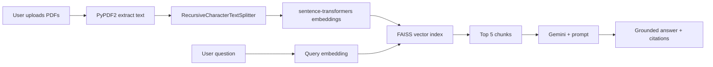

# Ask My Docs

**AI Developer Assessment Project** — Retrieval-Augmented Generation (RAG) PDF Question Answering System

---

## Candidate Details

| Field | Your Information |
|-------|------------------|
| **Name** | _[Your Full Name]_ |
| **Email** | _[your.email@example.com]_ |
| **GitHub** | [https://github.com/Sanjanamanjunath2515/ask-my-docs-rag](https://github.com/Sanjanamanjunath2515/ask-my-docs-rag) |
| **LinkedIn** | _[Optional]_ |
| **Assessment Date** | _[Date submitted]_ |

---

## Project Overview

**Ask My Docs** lets users upload multiple PDF documents, index them with local embeddings and FAISS vector search, and ask natural-language questions. Answers are generated by **Google Gemini** using only retrieved document context, with expandable **source citations** (filename, page, chunk text).

Built for clarity and interview explanation — modular Python utilities and a polished Streamlit UI.

---

## Tech Stack

| Layer | Technology |
|-------|------------|
| UI | Streamlit |
| PDF extraction | PyPDF2 |
| Chunking | LangChain `RecursiveCharacterTextSplitter` |
| Embeddings | sentence-transformers (`all-MiniLM-L6-v2`) |
| Vector DB | FAISS (cosine similarity via normalized inner product) |
| LLM | Google Gemini API |
| Config | python-dotenv |

---

## Project Structure

```
pdf-rag-chatbot/
│
├── app.py                 # Streamlit application
├── requirements.txt
├── README.md
├── .env.example
├── .gitignore
│
├── assets/
│   └── uploading.json     # Hero Lottie animation
├── utils/
│   ├── pdf_loader.py      # PDF text extraction
│   ├── text_splitter.py   # Chunking with metadata
│   ├── embeddings.py      # Local embeddings + cache
│   ├── vector_store.py    # FAISS index
│   ├── qa_chain.py        # Retrieval + Gemini QA
│   ├── retrieval.py       # Hybrid reranking
│   ├── ui_styles.py       # Dark/light theme CSS
│   └── ui_components.py   # UI components
│
├── data/                  # Embedding cache & FAISS index (gitignored)
├── screenshots/
└── sample_pdfs/           # Place test PDFs here
```

---

## Installation

### Prerequisites

- Python **3.10+**
- [Google AI Studio API key](https://aistudio.google.com/apikey)

### 1. Clone the repository

```bash
git clone https://github.com/Sanjanamanjunath2515/ask-my-docs-rag.git
cd ask-my-docs-rag
```

### 2. Create a virtual environment

**Windows (PowerShell):**

```powershell
python -m venv venv
.\venv\Scripts\Activate.ps1
```

**macOS / Linux:**

```bash
python3 -m venv venv
source venv/bin/activate
```

### 3. Install dependencies

```bash
pip install -r requirements.txt
```

> First run downloads the embedding model (~90 MB). Allow a few minutes on slow networks.

---

## Environment Setup

1. Copy the example env file:

```bash
copy .env.example .env
```

(macOS/Linux: `cp .env.example .env`)

2. Edit `.env` and set your Gemini API key:

```
GOOGLE_API_KEY=your_actual_api_key_here
```

Never commit `.env` to Git.

---

## Run Locally

From the project root (where `app.py` lives):

```bash
streamlit run app.py
```

Open the URL shown in the terminal (usually `http://localhost:8501`).

### Quick test flow

1. Add 3+ PDFs to `sample_pdfs/` or upload via the sidebar.
2. Click **Process Documents**.
3. Ask a question in the chat input.
4. Expand **Source citations** to verify grounding.

---

## Deployment (Streamlit Community Cloud)

1. Push the project to a **public** GitHub repository.
2. Go to [share.streamlit.io](https://share.streamlit.io) and sign in with GitHub.
3. Click **New app** → select repo, branch `main`, main file path: `app.py`.
4. Under **Advanced settings → Secrets**, add:

```toml
GOOGLE_API_KEY = "your_actual_api_key_here"
```

5. Deploy. First build may take several minutes (embedding dependencies).

### Deployed URL

Deploy at [share.streamlit.io](https://share.streamlit.io) → connect repo `Sanjanamanjunath2515/ask-my-docs-rag` → main file `app.py` → add `GOOGLE_API_KEY` in Secrets.

`https://YOUR_APP_NAME.streamlit.app/` _(add after deploy)_

---

## Architecture



1. **Ingestion** — PDFs are parsed page-by-page; invalid files are skipped with clear errors.
2. **Chunking** — ~900-character chunks with 150-character overlap preserve context across splits.
3. **Embedding** — `all-MiniLM-L6-v2` runs locally; optional disk cache speeds re-processing.
4. **Retrieval** — FAISS returns top-5 semantically similar chunks.
5. **Generation** — Gemini receives context + optional chat history and must answer only from context.

---

## Completed Features Checklist

- [x] Upload multiple PDFs (3+ encouraged)
- [x] PyPDF2 extraction with invalid PDF handling
- [x] LangChain recursive splitting (700–1000 char range)
- [x] Local sentence-transformers embeddings
- [x] FAISS semantic search
- [x] Top-5 retrieval + Gemini grounded QA
- [x] “I don’t know based on these documents.” fallback
- [x] Source citations (chunk, filename, page)
- [x] Streamlit UI (sidebar, process, chat, history, spinners, messages)
- [x] Modular `utils/` package
- [x] `.env` for secrets
- [x] README, `.gitignore`, Streamlit Cloud ready

---

## Known Limitations

- **Scanned PDFs** — Image-only PDFs without OCR return no extractable text.
- **Page numbers** — Attribution is approximate when chunks span page boundaries.
- **Memory** — Entire index is in RAM; very large corpora may need chunking limits.
- **Session scope** — Re-upload or refresh clears the index unless rebuilt.
- **Gemini availability** — Model name may need adjustment if your API region differs.

---

## Assumptions

- Users have a valid `GOOGLE_API_KEY`.
- PDFs contain selectable text (not scanned images without OCR).
- English queries work best with `all-MiniLM-L6-v2`.
- Running from project root so `utils` imports resolve.

---

## Bonus Features

- [x] **Embedding caching** — `data/embedding_cache/` avoids re-embedding identical chunk sets
- [x] **Conversation memory** — Last turns included in Gemini prompt
- [x] **Improved UI** — Custom theme, stat cards, chat styling, DM Sans font
- [x] **FAISS index persistence** — Optional save to `data/faiss_index/`
- [x] **Cosine-normalized search** — Better retrieval quality via L2-normalized inner product

---

## Demo Recording

_[Add link to Loom/YouTube demo after recording]_

---

## Sample Questions & Expected Behavior

Use your own PDFs; examples below assume technical documentation content.

| # | Sample Question | Expected Behavior |
|---|-----------------|-------------------|
| 1 | What is the main topic of the first document? | Summarizes from retrieved chunks; cites filename/page |
| 2 | List the key steps described in the installation section. | Bullet-style answer from matching chunk only |
| 3 | What version of Python is required? | Exact version if present in PDF; otherwise “I don’t know…” |
| 4 | Compare requirements mentioned in document A vs document B. | Uses chunks from both files when indexed together |
| 5 | Who is the CEO of Apple in 2025? | Should return **I don’t know based on these documents.** if not in PDFs |

---

## GitHub Push Commands

```bash
git init
git add .
git commit -m "Add Ask My Docs RAG PDF chatbot assessment project"
git branch -M main
git remote add origin https://github.com/YOUR_USERNAME/pdf-rag-chatbot.git
git push -u origin main
```

---

## License

Assessment / educational use. Update as needed for your submission.

---

## Contact

_[Your name and email for recruiters reviewing this submission]_
